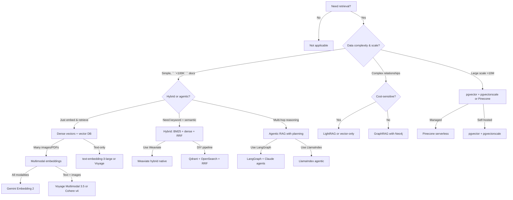

import { Card, Cards } from 'fumadocs-ui/components/card';

Data Retrievability is how effectively your codebase enables agents to find, understand, and retrieve information. This includes vector embeddings (dense and multimodal), vector databases, hybrid search combining keyword and semantic matching, reranking for precision, intelligent chunking strategies, knowledge graphs for complex reasoning, agentic RAG patterns with query planning, and evaluation frameworks that measure retrieval quality.

## Summary

In April 2026, the consensus is clear: naive dense-only vector search is outdated. Production systems use hybrid retrieval (BM25 sparse + dense vectors + reranking), agentic RAG with query planning beats single-stage pipelines, and Anthropic's Contextual Retrieval pattern (prepending summaries to chunks) reduces retrieval failures by 49–67%. pgvector + pgvectorscale now matches Pinecone's performance at 75% lower cost, and LightRAG achieves 6,000x token efficiency over traditional GraphRAG.

**Key takeaways:**
- **Hybrid > Dense:** Always combine keyword (BM25) + semantic (dense vectors) + reranking. Fusion (RRF) beats either alone.
- **Contextual > Raw:** Prepend chunk-specific summaries via Claude before embedding. Prompt caching keeps costs low.
- **Agentic RAG:** Query planning, multi-hop retrieval, and reflection loops outperform naive embed-retrieve-generate.
- **LightRAG > GraphRAG:** 6,000x cheaper, retrieves entities/relations directly, not community traversal.
- **Evaluate obsessively:** RAGAS metrics (faithfulness, context recall) + MTEB benchmarks + domain-specific metrics in CI/CD.

## Decision tree: When to use what

## The 2026 retrieval stack (recommended)

For most TypeScript/Node teams:

| Layer | Choice | Why |
|-------|--------|-----|
| **Embeddings** | OpenAI text-embedding-3-large or Voyage 3 | Mature, integrated APIs; Voyage cheaper |
| **Multimodal** | Voyage Multimodal 3.5 or Gemini 2 | Handle PDFs, slides, images natively |
| **Vector DB** | pgvector + pgvectorscale (cost) OR Pinecone serverless (managed) | pgvector 75% cheaper; Pinecone hands-off |
| **Hybrid layer** | Weaviate (native) OR Qdrant + OpenSearch (flexible) | Weaviate has BM25 built-in; Qdrant more control |
| **Reranking** | Cohere Rerank 3.5 or Voyage Rerank 2.5 | Two-stage always beats one-stage |
| **Chunking** | Anthropic Contextual Retrieval | 49–67% failure reduction; prompt caching = low cost |
| **Knowledge Graph** | LightRAG (efficient) OR Neo4j (enterprise) | LightRAG 6,000x cheaper; Neo4j if schema-heavy |
| **Agentic RAG** | LangGraph (LangChain) or LlamaIndex agents | Reflection + dynamic tool selection |
| **Evaluation** | RAGAS + MTEB + domain metrics in CI/CD | Measure faithfulness, context recall, recall@k |

## Dimensions & pages

<Cards>
  <Card
    title="Dense Embeddings"
    description="OpenAI, Voyage, Cohere, Google, and open-source models. Model selection, Matryoshka embeddings, cost vs. quality."
    href="/docs/data-retrievability/embeddings"
  />
  <Card
    title="Multimodal Embeddings"
    description="Image, video, and audio embeddings. Voyage Multimodal 3.5, Gemini 2, CLIP, SigLIP."
    href="/docs/data-retrievability/multimodal-embeddings"
  />
  <Card
    title="Vector Databases"
    description="Pinecone, Weaviate, Qdrant, pgvector, LanceDB, Milvus. When to pick each, comparison matrix."
    href="/docs/data-retrievability/vector-databases"
  />
  <Card
    title="Hybrid Search"
    description="BM25 + dense + RRF fusion. Why hybrid beats dense-only. TypeScript examples with Qdrant + OpenSearch."
    href="/docs/data-retrievability/hybrid-search"
  />
  <Card
    title="Reranking"
    description="Two-stage retrieval. Cohere Rerank 3.5/4.0, Voyage Rerank 2.5, BGE. Cost vs. quality trade-offs."
    href="/docs/data-retrievability/reranking"
  />
  <Card
    title="Chunking Strategies"
    description="Fixed, semantic, late, contextual (Anthropic). Overlap, anti-patterns, prompt caching."
    href="/docs/data-retrievability/chunking"
  />
  <Card
    title="Knowledge Graphs"
    description="Neo4j, KuzuDB, GraphRAG, LightRAG. When graph retrieval beats vectors. Hybrid graph+vector."
    href="/docs/data-retrievability/knowledge-graphs"
  />
  <Card
    title="Agentic RAG"
    description="Query planning, multi-hop retrieval, self-RAG, reflection loops. LangGraph, LlamaIndex."
    href="/docs/data-retrievability/agentic-rag"
  />
  <Card
    title="Evaluation Frameworks"
    description="RAGAS (faithfulness, context recall), MTEB, BEIR, recall@k, nDCG. TypeScript eval loops."
    href="/docs/data-retrievability/evaluation"
  />
  <Card
    title="Anti-Patterns"
    description="Dense-only retrieval, no chunking, no reranking, stale embeddings, skipping evaluation."
    href="/docs/data-retrievability/anti-patterns"
  />
</Cards>

## Why this dimension matters for agents

AI agents cannot "just figure out" where information lives or how to retrieve it. They depend entirely on what the system exposes:

- **Dense-only retrieval fails on rare terms.** Agents asking about niche features need exact keyword matches + semantic understanding. Hybrid search provides both.
- **Single-stage retrieval misses multi-hop reasoning.** Complex questions (e.g., "which vendors supply my manufacturer, and who are their competitors?") need agentic query decomposition and iteration.
- **Raw chunks without context lose meaning.** A chunk saying "revenue grew 3%" is useless without company, time period, and baseline. Contextual Retrieval prepends this.
- **Opaque retrieval quality kills reliability.** Without RAGAS metrics and domain evals, agents hallucinate based on poor retrievals. Measure everything.
- **Token efficiency at scale is non-negotiable.** Agents iterating over 10+ retrievals need LightRAG ($0.15 per doc) not GraphRAG ($4–7 per doc).

## Implementation flow

1. **Choose embedding model** → OpenAI, Voyage, or open-source based on cost/latency/modality
2. **Pick vector DB** → Pinecone (managed), pgvector (cheap), Qdrant (flexible), or Weaviate (hybrid-native)
3. **Add hybrid layer** → BM25 index (Elasticsearch, Typesense) + fusion (RRF) if not Weaviate
4. **Implement chunking** → Fixed-size baseline; upgrade to Contextual Retrieval (Anthropic pattern)
5. **Add reranking** → Cohere or Voyage two-stage retrieval (retrieve top-50, rerank to top-5)
6. **Build agentic RAG** → Query planning + reflection loops (LangGraph or LlamaIndex)
7. **Evaluate constantly** → RAGAS metrics in CI/CD, MTEB for embeddings, domain-specific tests
8. **Monitor drift** → Re-embed samples monthly; track embedding similarity distribution

## Common questions

**Q: Do I need a vector database?**  
A: Yes, if you want agent-driven search. BM25 alone (keyword-only) fails on synonyms and paraphrasing. Vector DBs are table stakes.

**Q: Dense or hybrid?**  
A: **Hybrid always.** Dense alone misses exact-match signals. Hybrid (BM25 + dense + RRF) beats either alone by 20–40% on MTEB-style benchmarks.

**Q: How much does reranking cost?**  
A: ~$0.01 per 1M tokens (negligible). Retrieve broad (top-50 dense), rerank narrow (top-5 rerank). Saves downstream generation costs by filtering irrelevant docs.

**Q: Contextual Retrieval sounds expensive.**  
A: Not with prompt caching. Cache the full document once (~50 tokens), reference it for chunk summaries. Cost amortizes to `<<1%` of embedding cost.

**Q: GraphRAG or LightRAG?**  
A: LightRAG (2025). GraphRAG is 6,000x more expensive ($4–7 vs $0.15 per document). Use GraphRAG only if you need explicit community-traversal reasoning and budget allows.

**Q: When do I need agents in RAG?**  
A: Simple queries (single-stage) work fine. Multi-hop (e.g., find all vendors), schema-driven (SQL + vector), or reflection-needing (rewrite, refine) queries need agentic RAG.
