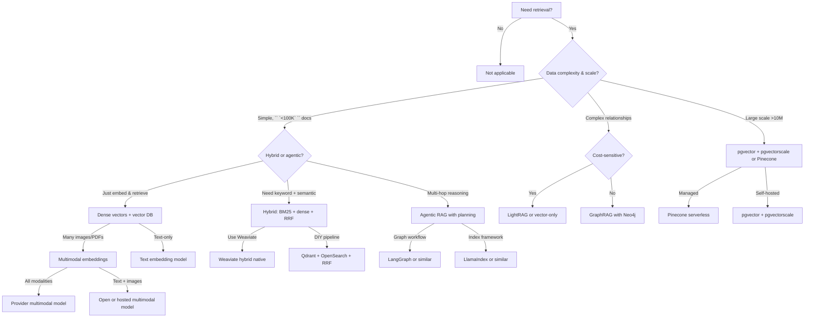

import { Card, Cards } from 'fumadocs-ui/components/card';

Data Retrievability is how effectively your codebase enables agents to find, understand, and retrieve information. This includes RAG pattern selection, embeddings, vector stores, hybrid retrieval, reranking, chunking, knowledge graphs, agentic query planning, and evaluation loops.

## Summary

Freshness note: last reviewed 2026-06-02. Retrieval model names, vendor pricing, benchmark ranks, and managed database features move quickly; verify current provider docs before treating any model or product mention as current.

The durable pattern is stable: production systems should usually combine sparse keyword retrieval, dense semantic retrieval, metadata filters, reranking, bounded context assembly, and evaluation. Dense-only vector search is a useful prototype baseline, but it is rarely enough for agent workflows that depend on exact identifiers, permissions, citations, and multi-step reasoning.

**Key takeaways:**
- **Hybrid beats dense-only for mixed corpora:** Combine keyword signals, dense vectors, filters, and fusion unless labelled evals prove one retriever is enough.
- **Chunking is product logic:** Preserve source, section, tenant, version, and citation metadata; do not index anonymous text blobs.
- **Reranking improves precision:** Retrieve broad, rerank narrow, then assemble only the context an answer can cite.
- **Agentic retrieval is an escalation path:** Use planning and reflection for multi-hop or multi-source questions, not for every search.
- **Evaluation is part of retrieval:** Track recall@k, nDCG, faithfulness, latency, cost, and drift before and after indexing changes.

## Decision tree: When to use what

## Reference retrieval stack

For most TypeScript/Node teams:

| Layer | Choice | Why |
|-------|--------|-----|
| **Embeddings** | Hosted or open model matched to language, modality, and data policy | Provider rankings and prices change; your eval set should decide. |
| **Multimodal** | Use only when source documents include images, diagrams, slides, audio, or video | Text-only corpora do not need multimodal cost or complexity. |
| **Vector DB** | Managed service, Postgres extension, or open-source vector store | Choose by ops burden, filtering, scale, and tenancy model. |
| **Hybrid layer** | Native hybrid search or dense store plus full-text index | Exact identifiers and semantic questions both matter. |
| **Reranking** | Hosted or self-hosted reranker over broad candidates | Improves precision when first-stage retrieval is noisy. |
| **Chunking** | Structural chunking plus metadata; contextual summaries when needed | Chunks need enough source context to be cited safely. |
| **Knowledge graph** | Add only when relationships are explicit and queried often | Graphs are maintenance commitments, not default retrieval. |
| **Agentic RAG** | Bounded query planning and validation for complex queries | Planning costs more; reserve it for multi-hop or multi-source work. |
| **Evaluation** | Recall, ranking, faithfulness, latency, cost, and drift gates | Retrieval changes need measurable regression checks. |

## Dimensions & pages

<Cards>
  <Card
    title="RAG Patterns"
    description="Naive, hybrid, contextual, graph, agentic, corrective, self-reflective, compiled, hierarchical, and multimodal RAG."
    href="/docs/data-retrievability/rag-patterns"
  />
  <Card
    title="Dense Embeddings"
    description="OpenAI, Voyage, Cohere, Google, and open-source models. Model selection, Matryoshka embeddings, cost vs. quality."
    href="/docs/data-retrievability/embeddings"
  />
  <Card
    title="Multimodal Embeddings"
    description="Image, video, and audio embeddings. Voyage Multimodal 3.5, Gemini 2, CLIP, SigLIP."
    href="/docs/data-retrievability/multimodal-embeddings"
  />
  <Card
    title="Vector Databases"
    description="Pinecone, Weaviate, Qdrant, pgvector, LanceDB, Milvus. When to pick each, comparison matrix."
    href="/docs/data-retrievability/vector-databases"
  />
  <Card
    title="Retrieval Pipeline"
    description="Chunking, hybrid retrieval, fusion, reranking, agentic planning, and evaluation as one practical loop."
    href="/docs/data-retrievability/retrieval-pipeline"
  />
  <Card
    title="Knowledge Graphs"
    description="Neo4j, KuzuDB, GraphRAG, LightRAG. When graph retrieval beats vectors. Hybrid graph+vector."
    href="/docs/data-retrievability/knowledge-graphs"
  />
  <Card
    title="Anti-Patterns"
    description="Dense-only retrieval, no chunking, no reranking, stale embeddings, skipping evaluation."
    href="/docs/data-retrievability/anti-patterns"
  />
</Cards>

## Why this dimension matters for agents

AI agents cannot "just figure out" where information lives or how to retrieve it. They depend entirely on what the system exposes:

- **Dense-only retrieval fails on rare terms.** Agents asking about niche features need exact keyword matches plus semantic understanding. Hybrid search provides both.
- **Single-stage retrieval misses multi-hop reasoning.** Complex questions (e.g., "which vendors supply my manufacturer, and who are their competitors?") need agentic query decomposition and iteration.
- **Raw chunks without context lose meaning.** A chunk saying "revenue grew 3%" is useless without company, time period, and baseline. Add source metadata and, where needed, contextual summaries.
- **Opaque retrieval quality kills reliability.** Without retrieval metrics and domain evals, agents hallucinate based on poor context. Measure the pipeline.
- **Token efficiency at scale is non-negotiable.** Agents that iterate over retrieval need budgets, candidate caps, and measured cost per workflow.

## Implementation flow

1. **Choose embedding model** -> based on cost, latency, modality, language, and data policy
2. **Pick vector DB** -> managed, Postgres-native, open-source, or hybrid-native based on operational constraints
3. **Design the pipeline** -> chunking, metadata, sparse index, dense index, fusion, reranking, and context assembly
4. **Add agentic retrieval only where needed** -> query planning, multi-hop retrieval, SQL or graph tools, and validation loops
5. **Evaluate constantly** -> recall@k, nDCG, faithfulness, latency, cost, and domain-specific tests
6. **Monitor drift** -> track chunker, model, index, and nearest-neighbor changes after reindexing

## Common questions

**Q: Do I need a vector database?**  
A: Usually, if you want semantic search over non-trivial corpora. BM25 alone fails on synonyms and paraphrasing, but vector search alone fails on exact identifiers. Most agent workflows need both signals.

**Q: Dense or hybrid?**  
A: Start hybrid unless your own evaluation set proves dense-only is good enough. Exact terms, rare names, API symbols, and filenames are common failure cases for dense-only retrieval.

**Q: How much does reranking cost?**  
A: It depends on provider, model, batching, and candidate size. The practical test is whether reranking reduces generation context enough to improve quality, latency, or total cost.

**Q: Contextual Retrieval sounds expensive.**  
A: It can be. Use it where chunks lose meaning without document-level context, then measure whether the added indexing cost improves recall and answer quality.

**Q: GraphRAG or LightRAG?**  
A: Use graphs when relationships are explicit, queried often, and worth maintaining. Prefer simpler vector or hybrid retrieval until relationship queries are a real product requirement.

**Q: When do I need agents in RAG?**  
A: Simple queries usually do not need agentic retrieval. Multi-hop, schema-driven, multi-source, or validation-heavy queries may need planning, tool selection, and bounded reflection.
