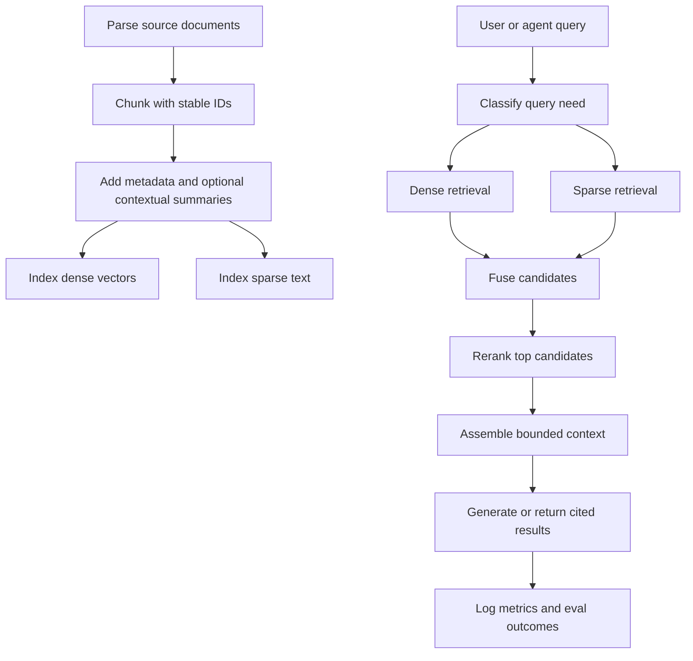

Retrieval quality comes from the whole pipeline, not from a vector database alone. A useful agent-facing retrieval system owns ingestion, chunking, metadata, sparse and dense retrieval, fusion, reranking, context assembly, and evaluation as one loop.

## Freshness note

Last reviewed: 2026-06-02. Model names, provider pricing, benchmark ranks, and SDK syntax change quickly. Treat vendor-specific examples as implementation sketches and verify current provider docs before hard-coding a model, price, or leaderboard claim.

## Default pipeline



For most production knowledge search, start with this shape:

1. Parse documents into text plus structure.
2. Chunk by section or fixed token windows, with stable document, section, page, tenant, and version metadata.
3. Add dense embeddings and a sparse keyword index.
4. Retrieve broadly from both systems.
5. Fuse with Reciprocal Rank Fusion or a database-native hybrid query.
6. Rerank to the final 5-10 passages.
7. Assemble context with source citations and token limits.
8. Run recall, ranking, faithfulness, latency, and cost checks in CI or release gates.

## Stage decisions

| Stage | Default | Use more complexity when | Failure signal |
|-------|---------|--------------------------|----------------|
| Chunking | 512-1024 tokens, 10-30% overlap, structural metadata | Sections, tables, PDFs, or legal/technical docs lose meaning | Correct doc retrieved, wrong passage selected |
| Context enrichment | Short document-aware chunk summaries | Chunks contain pronouns, local references, or repeated headings | Retrieved text is true but ambiguous |
| Sparse retrieval | BM25 or equivalent full-text search | Exact IDs, filenames, API names, tickets, or error codes matter | User sees obvious keyword misses |
| Dense retrieval | Embedding search over normalized chunks | Queries use synonyms, paraphrases, or fuzzy intent | Keyword search misses semantic matches |
| Fusion | RRF across sparse and dense lists | Native hybrid search exists and is easy to tune | One retriever dominates good results |
| Reranking | Retrieve 50-100, rerank to 5-10 | Top-k contains near misses or duplicate passages | Generation context is noisy |
| Agentic planning | Rule-based first, model-planned only for complex queries | Multi-hop, SQL plus vectors, graph traversal, or validation required | Single query cannot gather enough context |
| Evaluation | Recall@k, nDCG, MRR, faithfulness, latency, cost | Business-critical answers or regulated domains | Retrieval changes ship without a quality signal |

## Chunking

Chunking splits documents into retrieval units. The goal is not uniform size; it is retrievable, attributable context.

| Pattern | Use when | Notes |
|---------|----------|-------|
| Fixed-size | You need a fast baseline | Start around 512-1024 tokens with 10-30% overlap. |
| Semantic | Documents have useful headings, paragraphs, or sections | Prefer this for docs, policies, specs, and support articles. |
| Parent-child | Small chunks need document-level context | Retrieve child passages but include parent title, section, and summary. |
| Contextual | Chunks lose meaning outside the source document | Prepend a short generated summary before indexing. Verify cost and provider behavior. |
| Late interaction | PDFs, tables, or visual layout matter | Use a late-interaction or multimodal retriever rather than flattening everything to text. |

Keep this metadata with every chunk:

- `document_id`, `chunk_id`, `parent_id`
- `source`, `canonical_url`, `title`, `section`
- `tenant_id`, `visibility`, `version`, `updated_at`
- `page`, `line_range`, or `anchor` when the source supports it
- `content_hash` for drift detection and reindexing

```typescript
type Chunk = {
  id: string;
  documentId: string;
  text: string;
  metadata: {
    source: string;
    title: string;
    section?: string;
    tenantId: string;
    visibility: "public" | "internal" | "private";
    updatedAt: string;
    contentHash: string;
  };
};

function fixedChunk(text: string, chunkSize = 800, overlap = 0.2) {
  const tokens = text.split(/\s+/);
  const step = Math.max(1, Math.floor(chunkSize * (1 - overlap)));
  const chunks: string[] = [];

  for (let i = 0; i < tokens.length; i += step) {
    const chunk = tokens.slice(i, i + chunkSize).join(" ").trim();
    if (chunk) chunks.push(chunk);
  }

  return chunks;
}
```

## Hybrid retrieval

Dense retrieval is strong for semantics. Sparse retrieval is strong for exact terms, rare names, identifiers, and quoted text. Use both unless your corpus and query set prove that one signal is enough.

```typescript
type SearchResult = {
  id: string;
  text: string;
  rank: number;
  score?: number;
  source: "dense" | "sparse";
};

function reciprocalRankFusion(
  resultLists: SearchResult[][],
  limit = 50,
  k = 60
) {
  const scores = new Map<string, { score: number; result: SearchResult }>();

  for (const results of resultLists) {
    results.forEach((result, index) => {
      const existing = scores.get(result.id);
      const score = (existing?.score ?? 0) + 1 / (k + index + 1);
      scores.set(result.id, { score, result });
    });
  }

  return [...scores.values()]
    .sort((a, b) => b.score - a.score)
    .slice(0, limit)
    .map(({ result, score }) => ({ ...result, score }));
}
```

Tune hybrid search against query classes, not instinct:

| Query type | Sparse weight | Dense weight | Notes |
|------------|---------------|--------------|-------|
| Error code, API, filename | Higher | Lower | Exact match should not be buried. |
| Conceptual question | Lower | Higher | Semantics matter more than literal terms. |
| Compliance or policy | Balanced | Balanced | Exact section names and paraphrases both matter. |
| Multi-tenant support | Balanced | Balanced | Filters are mandatory before ranking. |

## Reranking

Reranking is a second stage that sorts broad retrieval candidates by query relevance. It is usually cheaper than sending too much noisy context to generation, but it still adds latency and provider dependency.

| Option | Best for | Tradeoff |
|--------|----------|----------|
| Hosted reranker | Fast integration, multilingual or enterprise needs | Provider pricing and model names change. |
| Open-source reranker | Cost control and data locality | You own latency, batching, and serving. |
| Late-interaction retriever | PDF, table, image-heavy, or long document retrieval | More storage and implementation complexity. |
| No reranker | Very small candidate sets or strict latency budgets | Requires stronger first-stage retrieval. |

```typescript
async function retrieveForAnswer(query: string) {
  const [dense, sparse] = await Promise.all([
    denseSearch(query, { limit: 100 }),
    sparseSearch(query, { limit: 100 }),
  ]);

  const candidates = reciprocalRankFusion([dense, sparse], 50);
  const reranked = await rerank(query, candidates, { limit: 8 });

  return reranked.map((result) => ({
    id: result.id,
    text: result.text,
    citation: result.metadata?.canonicalUrl,
    score: result.score,
  }));
}
```

Do not use reranking to hide bad ingestion. If the right passage is not in the candidate set, the reranker cannot recover it.

## Agentic retrieval

Agentic retrieval is useful when a single query is not enough. It should be a controlled escalation, not the default path for every search.

Use it for:

- multi-hop questions across documents or entities
- schema-driven questions that need SQL plus unstructured context
- graph traversal plus vector search
- query rewriting when the first retrieval is weak
- answer validation against retrieved evidence

Avoid it for:

- simple lookup, FAQ, or keyword search
- strict latency paths
- high-volume workloads without token budgets
- systems without observability and replay

```typescript
type RetrievalPlan = {
  strategy: "hybrid" | "graph" | "sql" | "multi_source";
  subQueries: string[];
  needsValidation: boolean;
};

async function plannedRetrieval(query: string) {
  const plan: RetrievalPlan = await planQuery(query);
  const contexts: string[] = [];

  for (const subQuery of plan.subQueries.slice(0, 5)) {
    if (plan.strategy === "sql") {
      contexts.push(await queryStructuredData(subQuery));
    } else if (plan.strategy === "graph") {
      contexts.push(await queryKnowledgeGraph(subQuery));
    } else {
      const results = await retrieveForAnswer(subQuery);
      contexts.push(results.map((result) => result.text).join("\n"));
    }
  }

  if (plan.needsValidation) {
    return validateContextCoverage(query, contexts);
  }

  return contexts.join("\n\n");
}
```

Put hard bounds around agentic retrieval:

- maximum sub-queries
- maximum tool calls
- maximum tokens and cost per request
- required metadata filters
- trace IDs for every retrieval call
- replayable prompts and retrieved document IDs

## Evaluation

Retrieval evaluation needs both system metrics and answer-quality metrics.

| Metric | What it measures | Good first gate |
|--------|------------------|-----------------|
| Recall@k | Whether known-relevant docs appear in the top k | `recall_at_10 >= 0.8` |
| nDCG@k | Whether more relevant docs rank higher | `ndcg_at_10 >= 0.8` |
| MRR | How quickly the first relevant result appears | `mrr >= 0.7` |
| Context precision | Whether retrieved context is mostly useful | Track per corpus and query type |
| Context recall | Whether enough evidence was retrieved | Track against labelled examples |
| Faithfulness | Whether the answer is supported by context | Gate high-risk answers |
| Latency p95 | Whether retrieval fits the product SLA | Set per endpoint |
| Cost per query | Whether agentic loops remain affordable | Set budget per workflow |

```typescript
function recallAtK(retrievedIds: string[], relevantIds: Set<string>, k = 10) {
  const retrieved = retrievedIds.slice(0, k);
  const matches = retrieved.filter((id) => relevantIds.has(id)).length;
  return matches / Math.max(1, relevantIds.size);
}

function ndcgAtK(relevances: number[], k = 10) {
  const dcg = relevances
    .slice(0, k)
    .reduce((sum, relevance, index) => {
      return sum + relevance / Math.log2(index + 2);
    }, 0);

  const ideal = [...relevances]
    .sort((a, b) => b - a)
    .slice(0, k)
    .reduce((sum, relevance, index) => {
      return sum + relevance / Math.log2(index + 2);
    }, 0);

  return ideal === 0 ? 0 : dcg / ideal;
}
```

Minimum CI gate:

```typescript
describe("retrieval quality", () => {
  test("keeps labelled answers retrievable", async () => {
    const cases = loadRetrievalCases();
    const scores = [];

    for (const item of cases) {
      const results = await retrieveForAnswer(item.query);
      scores.push(recallAtK(results.map((result) => result.id), item.relevantIds));
    }

    const meanRecall = scores.reduce((sum, score) => sum + score, 0) / scores.length;
    expect(meanRecall).toBeGreaterThanOrEqual(0.8);
  });
});
```

Track drift after indexing changes:

- sample stable documents monthly or after model changes
- re-embed the sample and compare nearest-neighbor sets, not only vector similarity
- alert when recall drops on labelled queries
- record embedding model, dimensions, tokenizer, chunker version, and index version

## Checklist

- [ ] Chunk IDs are stable across reindexing.
- [ ] Every retrieval path applies tenant and visibility filters before ranking.
- [ ] Sparse and dense indexes are both covered by tests.
- [ ] Reranking is measured against a labelled query set.
- [ ] Agentic retrieval has tool, token, latency, and cost budgets.
- [ ] Generated answers include citations or source IDs.
- [ ] CI blocks regressions in recall or ranking quality.
- [ ] Logs capture query, retrieved IDs, ranks, filters, model versions, and trace IDs.
- [ ] Reindexing has a rollback path.
- [ ] Vendor claims, model choices, and prices are reviewed before production releases.
